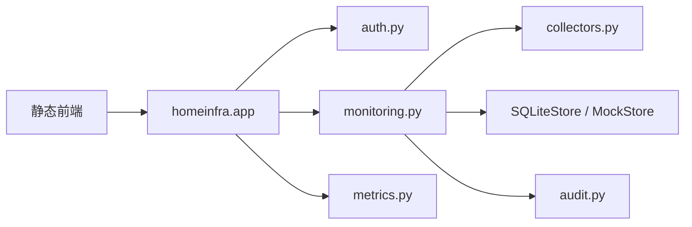

# Architecture

## 总览

当前项目是一个本地优先的家庭设备监控面板，结构保持轻量：

- 后端：Python 标准库 HTTP 服务
- 前端：原生静态 HTML/CSS/JS，本地 vendor 浏览器依赖
- 存储：SQLite JSON 状态存储，默认开启
- 采集：默认关闭，真实 SSH 采集器按需启用

## 目录结构

| 路径 | 作用 |
| --- | --- |
| `run.py` | 启动入口，负责 host/port/store/ssh 参数 |
| `homeinfra/app.py` | HTTP 路由、请求解析、RBAC、审计接线 |
| `homeinfra/monitoring.py` | 设备、分组、采集记录、告警的核心领域逻辑 |
| `homeinfra/collectors.py` | SSH 采集抽象、mock 采集器、paramiko 采集器 |
| `homeinfra/persistence.py` | SQLite JSON 状态存储 |
| `homeinfra/mock_data.py` | 默认 seed 数据 |
| `homeinfra/metrics.py` | health/metrics 输出 |
| `homeinfra/audit.py` | 审计日志 |
| `homeinfra/auth.py` | 认证、会话与角色检查 |
| `static/` | 原生监控面板前端 |
| `tests/` | `unittest` 测试 |

## 运行流

## 核心对象

### 设备分组

字段：

- `id`
- `name`
- `description`
- `color`
- `icon`
- `sort_order`
- `created_at`
- `updated_at`

### 设备

字段：

- `id`
- `name`
- `host`
- `port`
- `username`
- `auth_type`
- `password`
- `private_key_path`
- `inline_private_key`（当前不接受内联私钥）
- `device_type`
- `group_id`
- `tags`
- `enabled`
- `poll_interval`
- `last_seen`
- `status`

### 采集记录

字段：

- `id`
- `device_id`
- `collector`
- `command`
- `collected_at`
- `status`
- `summary`
- `payload`
- `error_message`

### 告警

字段：

- `id`
- `device_id`
- `group_id`
- `severity`
- `status`
- `type`
- `message`
- `created_at`
- `resolved_at`

## 存储策略

默认使用 `SQLiteStore`。

当前实现不是 ORM，而是轻量 JSON 状态表：

- 优点：依赖少、迁移快、适合单进程 MVP
- 代价：复杂查询能力有限，后续可以按需拆关系表

支持两种模式：

- `sqlite`
- `mock`

## 采集策略

### DisabledCollector / 样例数据回显

- 默认关闭真实采集
- 不连接真实设备
- 设备详情可回显最近一次有效记录或默认示例字段

### ParamikoSSHCollector

- 仅在 `COLLECTOR_MODE=ssh` 或 `--collector-mode=ssh` 时启用
- 只执行白名单只读命令
- 强制 timeout
- 默认拒绝未知 host key
- 优先使用外部只读私钥路径，不接受内联私钥内容

## 安全边界

- 没有任意命令执行入口
- SSH 采集仅允许白名单只读命令
- 不包含系统级写入或危险运维动作

## 前端策略

前端只做：

- Dashboard 汇总展示
- 设备分组管理
- 设备列表与详情
- 告警处理

不做复杂框架迁移，不引入 SPA 框架。
静态资源默认由后端直接提供；`Chart.js` 固定版本 vendor 在 `static/vendor/`，不依赖外部 CDN。

## 当前已知限制

- 当前采用本地用户名/密码加 Bearer Token 会话，不适合直接暴露到公网
- Docker 默认由 `APP_HOST` 控制容器内监听，由 `HOST_BIND` 控制宿主机暴露面；默认仅发布到 `127.0.0.1`
- SQLite 当前是状态快照存储，不是细粒度关系模型
- 真实 SSH 采集未在真实主机上联调
- 前端没有浏览器级自动化测试，当前以 `node --check` 和 `unittest` 为主
