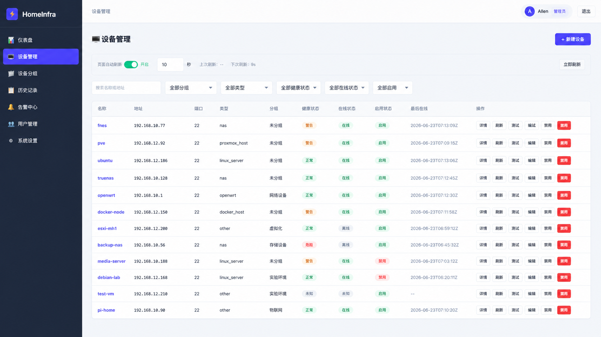

# HomeInfra Control Center

`HomeInfra Control Center` 是一个轻量级的家庭基础设施监控与管理面板，适用于 NAS、Linux 服务器、路由器、迷你主机等设备。

这是我第一个相对完整的个人项目。开发过程中使用了 AI 工具辅助完成部分代码编写、问题排查和结构整理，但需求设计、功能取舍、测试验证、部署处理和最终仓库整理都由我自己参与完成。

## 项目概览

这个项目是一个本地优先、部署成本较低的 Web 应用，整体结构比较轻量：

- 基于 Python 标准库 HTTP 栈的后端
- 基于静态 HTML、CSS、JavaScript 的前端
- 默认使用 SQLite 持久化
- 可选的 SSH 只读采集能力，用于设备监控

它主要面向家庭或实验环境，不适合直接暴露到公网。

## 界面截图



## 功能特性

- 设备的新增、编辑、删除、启用/禁用、测试连接和手动刷新
- 设备分组管理，方便按类别组织监控对象
- 历史采集记录与筛选查询
- 告警生成与处理流程
- 关键操作的审计日志
- 本地用户管理，支持 `admin`、`operator`、`viewer` 三种角色
- 历史数据保留策略与清理能力

## 技术栈

- Python 3
- SQLite
- 原生 JavaScript
- HTML/CSS
- Docker Compose
- Paramiko（用于可选 SSH 采集）

## 部署方式

本地运行：

```sh
python3 run.py --host 127.0.0.1 --port 8010 --static-dir static
```

打开：

```text
http://127.0.0.1:8010/
```

使用 Docker 运行：

```sh
docker compose up --build
```

默认 Compose 配置会使用 `HOST_BIND=127.0.0.1`，也就是只把 Web 入口发布到本机回环地址；如需改成其他监听地址，请显式覆盖 `HOST_BIND`。
`APP_HOST` 只控制容器内进程监听地址，`HOST_BIND` 才决定宿主机暴露面；默认配置不会把服务直接开放到公网。

## 配置说明

重要默认项：

- 数据库路径：`./data/homeinfra.db`
- 静态资源目录：`./static`
- 环境变量示例：[`.env.example`](./.env.example)
- 容器内监听：`APP_HOST`，默认 `0.0.0.0`
- 宿主机发布边界：`HOST_BIND`，默认 `127.0.0.1`

启动时可以覆盖数据库路径：

```sh
python3 run.py --db-path /app/data/homeinfra.db
```

首次启动且数据库为空时，系统会要求先创建第一个管理员账号，之后才能正常登录使用。

## 采集模式

采集行为由 `COLLECTOR_MODE` 控制。

| 模式 | 值 | 说明 |
| --- | --- | --- |
| Disabled | `disabled` | 仅保存设备配置，不执行采集 |
| SSH | `ssh` | 通过 SSH 连接目标设备，执行应用内置只读 probe（经危险 token denylist 校验，非用户可配置 allowlist） |

出于公开项目的默认安全考虑，`.env.example` 中的 `SSH_AUTO_ACCEPT_HOST_KEY` 默认值为 `0`，即默认不自动接受 SSH 主机指纹。

如果是在受信任的家庭内网环境中进行首次接入测试，可以临时设置为：

```sh
SSH_AUTO_ACCEPT_HOST_KEY=1
```

完成首次确认后，建议改回 `0`，并配合 `SSH_KNOWN_HOSTS` 使用。

本地运行示例：

```sh
python3 run.py --host 127.0.0.1 --port 8010 --static-dir static
COLLECTOR_MODE=ssh python3 run.py --host 127.0.0.1 --port 8010 --static-dir static
```

SSH 密钥示例：

```sh
mkdir -p ./ssh-keys
ssh-keygen -t ed25519 -C "homeinfra-monitor" -f ./ssh-keys/id_ed25519
ssh-copy-id -i ./ssh-keys/id_ed25519.pub monitor@example-host
```

推荐凭据策略：

- 优先使用只读、低权限的外部私钥文件路径，例如 `private_key_path=/app/ssh-keys/id_ed25519`
- 不要把明文 SSH 密码写入仓库或长期保存在应用数据文件中
- 当前实现不接受内联私钥内容；如果使用密码认证，应通过外部凭据源在运行时注入
- 在真实 SSH 采集模式（`COLLECTOR_MODE=ssh`）下，password 认证设备不会使用落库明文密码采集；如果没有外部凭据源注入，这类设备的采集会失败。推荐改用只读低权限 `key_path` / `private_key_path`

升级提示：

- 本版本起，旧 `devices.password` 中的明文 SSH 密码会在加载时被非破坏性清理（password 认证设备改写为外部凭据占位符，其他认证类型置空），`encrypted_private_key` 内联密钥也会被清空
- 升级后，原明文 SSH 密码应视为已暴露，请立即轮换；password 认证设备需要重新配置外部凭据源或改用 `key_path`

容器内路径示例：

```json
{
  "private_key_path": "/app/ssh-keys/id_ed25519"
}
```

## 测试

基础检查：

```sh
python3 -m unittest -v
node --check static/app.js
```

仓库内也提供了对应的 GitHub Actions 基础 CI，默认执行与这里一致的 Python 测试、前端语法检查和编译检查。

可选编译检查：

```sh
PYTHONPYCACHEPREFIX=/private/tmp/homeinfra-pyc python3 -m compileall homeinfra run.py tests
```

在准备好的环境中，也可以执行可选的 SSH 烟雾测试：

```sh
chmod +x smoke_test.sh
./smoke_test.sh
```

更多测试说明见 [`TESTING.md`](./TESTING.md)。

## 说明

- 这是一个本地优先项目，建议始终放在可信网络边界之后使用。
- 默认静态资源全部从本地 `static/` 提供；`Chart.js` 已 vendor 到 `static/vendor/`，不依赖外部 CDN。
- SSH 采集器只用于只读监控，执行应用内置 probe 命令并经危险 token denylist 校验；当前不提供用户可配置命令 allowlist（Phase-2 可考虑 probe-id allowlist）。
- 这个项目目前还比较初级，后续我会继续迭代和完善。使用过程中如果遇到问题，欢迎直接提出，我会尽快排查和修复；如果有新的建议或你希望支持的功能，也欢迎继续反馈。
- 更多接口与实现说明可参考 [`API.md`](./API.md)、[`ARCHITECTURE.md`](./ARCHITECTURE.md) 和 [`前端API调用规则.md`](./前端API调用规则.md)。

## 许可证

本项目使用 MIT License。
